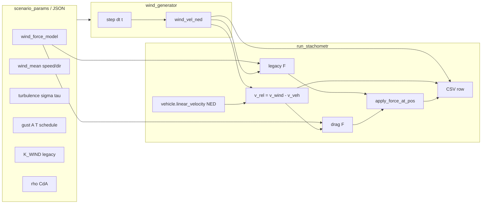

# Plan: wiatr dynamiczny, model drag + legacy, logi CSV

## Kontekst

Obecnie w `[stachometr/run_stachometr.py](stachometr/run_stachometr.py)` przy `wind_suffix == "wind"` liczona jest **stała** siła `F = K_WIND_N_PER_MS * wind_speed * (ux, uy, 0)` i co krok `apply_force_at_pos`. CSV **nie** zawiera wektora wiatru ani siły (`[csv_header` ok. L614–630](stachometr/run_stachometr.py)).

**Wymaganie:** model jak u Gemini (V_rel, F z ρ i Cd·A) **oraz** **bez usuwania** starego modelu — przełącznik w konfiguracji.

---

## Architektura (przepływ danych)

---

## 1. Nowy moduł generatora wiatru

**Plik:** `[stachometr/wind_generator.py](stachometr/wind_generator.py)` (nowy)

- `**DynamicWindGenerator`** (stan: `t`, wektor turbulencji w płaszczyźnie poziomej NED, ewentualnie `z=0` lub mały szum Z — domyślnie **tylko XY**, żeby nie „wyrzucać” drona w pionie bez uzasadnienia).
- **Średnia:** z parametrów `wind_speed_ms` (skalar wzdłuż kierunku meteo) + `wind_dir_deg` → wektor bazowy `w_mean` (NED).
- **Turbulencja (zamiast pełnego Drydena w pierwszej iteracji):** niezależny **Ornstein–Uhlenbeck / Langevin** na `δn, δe` (odpowiednik „płynnego” szumu z czasem relaksacji `tau` i `sigma`), zgodny z intencją Geminiego (zależność od poprzedniej próbki, nie surowy biały szum co krok). Wzór w kodzie z komentarzem o związku z Drydenem.
- **Podmuchy (1−cos):** scheduler: lista lub losowe okna `(t_start, T, amplitude_vector lub skalar w płaszczyźnie)`; dodawany wektor `gust_ned(t)`; **lulls** jako gust z ujemną amplitudą względem składowej wzdłuż `w_mean` (ograniczenie clamp, żeby |w| nie schodził poniżej 0 po składowej „wzdłuż wiatru” jeśli tak zdecydujecie).
- `**step(dt, sim_time_s) -> (wind_vel_ned: tuple[float,float,float], gust_phase: str | None)`** — zwraca **pełny** wektor prędkości wiatru w NED używany jako etykieta i do fizyki.
- **RNG:** `random.Random(seed)` — seed z `[--seed](stachometr/run_stachometr.py)` + opcjonalnie `run_id`, żeby batch był powtarzalny.
- `**ConstantWindGenerator`:** tylko `w_mean` (zachowanie jak dziś po stronie *prędkości wiatru* — używane gdy `wind_dynamic_enabled=False`).

---

## 2. Parametry w `[stachometr/scenario_params.py](stachometr/scenario_params.py)`

Dodać strukturę (dict / stałe + merge w `get_scenario_1_fixed_params` i ewentualnie `draw_scenario_*`):

| Klucz                         | Znaczenie                                                                                                |
| ----------------------------- | -------------------------------------------------------------------------------------------------------- |
| `wind_force_model`            | `"legacy"` | `"drag"`                                                                                    |
| `wind_dynamic_enabled`        | `bool` — czy używać `DynamicWindGenerator`                                                               |
| `wind_tau_s`, `wind_sigma_ms` | turbulencja OU (XY)                                                                                      |
| `wind_gust_*`                 | np. `prob_per_s`, `T_min_s`, `T_max_s`, `A_rel_ms` (amplituda względem mean), `lull_enabled`             |
| `wind_rho_kg_m3`              | domyślnie 1.225                                                                                          |
| `wind_cd_times_area_m2`       | jeden parametr **Cd·A** (m² w sensie efektywnym), żeby nie dublować nieznanych Cd i A osobno na start    |
| Kalibracja                    | Krótki komentarz: dobrać `wind_cd_times_area_m2` tak, przy referencyjnym `V_rel` i `wind_speed`, żeby ** |

**Legacy:** gdy `wind_force_model=="legacy"`, siła jak dziś: `F = K_WIND_N_PER_MS * |wind_speed_ref| * direction` — przy wietrze dynamicznym `**wind_speed_ref`** może być **długość bieżącego `wind_vel_ned` horyzontalnie** (żeby skala „m/s z JSON” nadal miała sens jako rząd wielkości średniej), albo **stała** ze średniej z parametrów — **rekomendacja:** użyć **‖w_horizontal‖** z generatora, żeby liniowy model reagował na porywy; w dokumencie opisać różnicę względem starego stałego przypadku.

**Drag (Gemini):**  
`v_air = v_vehicle_ned - v_wind_ned` (prędkość drona względem masy powietrza; opór przeciwny do ruchu względem powietrza):

`F_drag = -0.5 * rho * (Cd*A) * |v_air| * v_air`  

(dla |v_air|≈0 wektor zerowy — uniknąć dzielenia przez zero). Opcjonalnie na pierwszy etap **tylko składowa pozioma** `v_air_xy`, żeby nie wprowadzać sztucznego pionowego oporu z uproszczonego modelu — opisać w WIATR.

---

## 3. Zmiany w `[stachometr/run_stachometr.py](stachometr/run_stachometr.py)`

1. **Inicjalizacja** (tuż po utworzeniu `vehicle` / znanym `physics_dt`, przed pętlą):
  - Odczyt parametrów wiatru z `params`.  
  - Utworzenie `ConstantWindGenerator` lub `DynamicWindGenerator`.  
  - Przechowywanie w closure `**current_wind_ned`**, `**current_v_air**`, `**current_F_ned**`.
2. `**_apply_wind_force()`:**
  - Co wywołanie: `t = step * physics_dt`.  
  - `w = generator.step(dt, t)`.  
  - `v = vehicle.state.linear_velocity` (NED jak w CSV — zweryfikować zgodność z Pegasusem; jeśli FLU, jedna jasna konwersja w jednym miejscu).  
  - Policzyć `v_air`, potem `F` wg `wind_force_model`.  
  - `apply_force_at_pos(..., Gf.Vec3f(F), pos_drona)`.
3. **CSV:** rozszerzyć `csv_header` o kolumny (nazwy zbliżone do Geminiego, NED):
  - `wind_vel_n`, `wind_vel_e`, `wind_vel_d`  
  - `wind_force_n`, `wind_force_e`, `wind_force_d`  
  - `v_air_n`, `v_air_e`, `v_air_d` (lub `v_rel_*` w nagłówku z komentarzem że to „powietrze względem drona”)  
  - Gdy brak wiatru: puste lub `0` — **spójnie** jedna konwencja.  
   W `log_state`: dopisać te pola z ostatnio policzonych wartości w `_apply_wind_force` (np. trzymać `last_wind_log` w `nonlocal`, aktualizowane w `_apply_wind_force` przed/po apply — kolejność: najpierw obliczenia, potem log w tym samym kroku co siła).
4. **Kolejność kroków:** zachować `**_apply_wind_force()` przed `world.step`** (jak teraz), żeby siła była w tym samym kroku co integracja.
5. **Panel na żywo** (`[_LiveDisplay](stachometr/run_stachometr.py)`): opcjonalnie dodać 2–3 pola (‖w‖, ‖F‖) — jeśli mało pracy; inaczej pominąć w pierwszej iteracji.

---

## 4. Dokumentacja

- `[stachometr/WIATR_OPIS.md](stachometr/WIATR_OPIS.md)`: sekcja **Dwa modele siły** (`legacy` vs `drag`), **generator** (OU + gusty), znaczenie kolumn CSV, konwencja NED / `v_air`.  
- `[docs/py/scenarios.md](docs/py/scenarios.md)`: jedna akapit, że JSON runu może zawierać nowe klucze wiatru.

---

## 5. Test / walidacja (ręczna)

- Run `--scenario_1_wind` z `wind_dynamic_enabled=False`, `wind_force_model=legacy` → porównać CSV: stałe `wind_vel_`*, siła zgodna ze starym logiem (moduł siły).  
- Ten sam z `wind_force_model=drag` i dobrane `Cd*A` → sensowny wzrost oporu z prędkością.  
- `wind_dynamic_enabled=True` → nienaruszone kolumny IMU, rosnąca zmienność `wind_vel_*`.

---

## Ryzyka i decyzje zamknięte w kodzie

- **Układ prędkości:** jedno miejsce konwersji body/world NED jeśli Pegasus zwraca inny układ niż NED — sprawdzenie w kodzie Pegasus / istniejące `vel_x,y,z` w CSV jako „prawda”.  
- **Pionowy wiatr:** domyślnie 0; turbulencja tylko XY — rozszerzenie później jednym parametrem.  
- **Zgodność wsteczna:** domyślne wartości w `get_scenario_1_fixed_params` tak, żeby **bez nowych kluczy w JSON** zachować obecne zachowanie (stały wiatr + legacy), chyba że świadomie zmienicie default w `SCENARIO_1_FIXED`.

